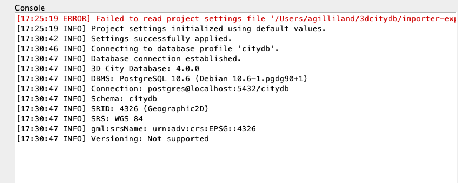
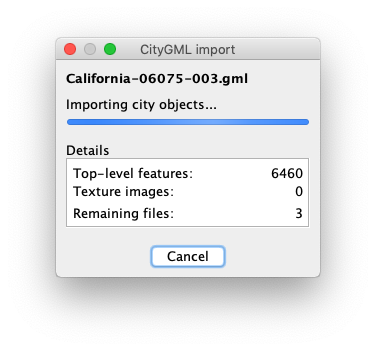
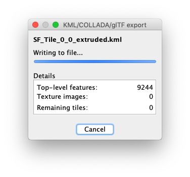

## Display a 3D model of any US city in Google Earth

This is an example of how you could use the Open City Model to view a 3D rendering of your city and perhaps gain a new perspective on where you live!  In this example we will start by loading a portion of the Open City Model into the [3dCityDB](https://www.3dcitydb.org/) which provides a foundation for doing geospatial work with 3D city objects.  Once we've loaded some data into our database we'll export a KML visualization of the buildings which we can easily view and play with in Google Earth.

### Software Requirements

We try to keep the examples as simple as possible but the world of geospatial software is still fairly complex and it should be kept in mind that this example is meant for a more technical audience.

* [Java 8+](https://www.java.com/en/download/) - You'll need a recent version of Java available on your computer in order to run the Importer-Exporter tool provided as part of the 3dCityDB.
* [Docker](https://www.docker.com/get-started) - For the sake of simplicity this example uses Docker for running the actual 3dCityDB instance which is a Postgres/PostGIS database.
* [Google Earth Pro](https://www.google.com/earth/versions/#earth-pro) - We will use this as a visualization tool for looking at our 3D city.

### I. Run 3dCityDB (via Docker)

This should be fairly straight forward as long as you have Docker running.  Simply run the following command to download the image and run a new container ...

```
docker run -dit --name citydb -p 5432:5432 -e "SRID=4326" -e "SRSNAME=urn:adv:crs:EPSG::4326" tumgis/3dcitydb-postgis
```

NOTE: this will attempt to map port 5432 in your new docker container to port 5432 on your computer, so you must be sure that port is unused.

### II. Install and launch 3dCityDB-Importer-Exporter application

The importer/exporter is a Java based desktop appliction which provides a nice UI for interacting with the data inside your 3dCityDB.

1. Head over to https://www.3dcitydb.org/3dcitydb/downloads/ and download the latest version of the application.
2. Execute the .jar file to launch the GUI installer.  On my Mac if I double-click the file I get a security warning, so I must right-click the file, then choose `Open With` > `Jar Launcher.app`
3. Follow the installer steps along the way and leave all the options at their defaults.  This is a standard installer with a language choice, a license to accept, and the option to pick where to install to.
4. Once the files are installed you can safely close the installer.
5. Now we want to launch the installed importer/exporter application by using the appropriate script in the `bin` folder of the location where you installed the files.  For example on my Mac I am launching `3DCityDB-Importer-Exporter/3dcitydb/bin/3DCityDB-Importer-Exporter` which I can simply double-click on in Finder.
6. If the importer/exporter is open and displaying on your desktop then you are good-to-go :+1:

### III. Connect Importer-Exporter to your 3dCityDB

With the importer/exporter running lets connect it to your database so that you can actually use these tools to get something done.

1. Click on the `Database` tab at the top.
2. Inside the `Connection Details` fill out the following data
    * Description = `citydb`
    * Username = `postgres`
    * Password = `postgres`
    * Type = `PostgreSQL/PostGIS`
    * Server = `localhost`
    * Database = `citydb`
3. Then click the `Apply` button on the right to save those inputs, followed by the `Connect` button at the bottom to actually connect.
4. With a successful connection to your 3dCityDB you should see some output on the `Console` to the right such as this ...



### IV. Import the Open City Model data you want into 3dCityDB

Now that we have a fully functioning 3dCityDB along with the importer/exporter lets get down to using some data!

1. Use the Open City Model download links to find the files for the US county you are interested in and download the CityGML files
    * NOTE: the files are only organized by US state & county, so if you are looking for a single city or town you'll have to do the county that location falls within.  it's currently not possible to get the data for a smaller location.
    * *TIP*: For my examples I'm using the files for San Francisco, Ca which has quite a few buildings in a small area, so it's fairly easy to work with.
2. Once you've downloaded the CityGML files they should be .zip compressed, so simply uncompress them to their original .gml files
3. Back in the importer/exporter application click on the `Import` tab at the top
4. Click the `Browse` button to locate your .gml files.  Highlight all the files you have and click `Choose`.  You should now see all of your selected files in the large text area at the top of the Import tab.
5. You are now set to simply click the `Import` button to load the Open City Model data into your 3dCityDB
    * A progress window will show you the progress as your files are loaded into the database, just wait until it's done with all the files.
    
6. After the import is completed you now have a bunch of buildings in your 3dCityDB you can use for a variety of applications :smiley:

### V. Export a 3D model and view it in Google Earth

Once you have a 3dCityDB running and loaded with data there are a lot of things you can do, but lets start with something simple that lets us visualize the data we just loaded in an app that's familiar to many people, Google Earth.

1. In the importer/exporter app lets click on the `KML/COLLADA/glTF Export` tab at the top
2. Click the `Browse` button and pick a location and file name for your exported 3d model, then click `Save`.  nothing is saved yet, this is just setting the file to export to.
3. Inside the `Export contents` section lets set the bounding box of what we want to see in our 3D model.
    * Click the small icon of the globe with a magnifying glass to visually pick your bounding box.
    * In the window that opens up, use the viewer to zoom down to earth into the part of your city/town you want to 3d model.  Go for a fairly well zoomed viewer to avoid exporting too large of a 3d model, which is slower.
    * Once you have the viewer set, right-click inside the viewer and click on `Get map bounds` from the menu.  This will capture the bounding box for the viewer and populate them in the upper left of the window.
    * Now simply click the `Apply` button in the top right corner.  You should now have your bounding box populated.
    * In the `Tiling` section you can leave the default setting of `No tiling`
4. Under `Export from level of detail` section you should pick `LoD1` from the dropdown menu
5. Within the `Display as` section you want to click the checkbox next to `Extruded` and set visible from `200` pixels
6. Now you're ready to export your 3D model, so click the `Export` button at the bottom.
    * Let the exporter work its magic and write out your 3D model.  Once it's done then we get to see the fruits of our labor.
    
7. Open up Google Earth Pro
8. Within Google Earth, click on `File` > `Open` from the application menu.  Navigate to the location you specified for your KML export in the previous step and choose that file.
9. You should now be looking at a 3D model of your city!
    * you can reduce some of the competing information coming from Google Earth by unchecking the boxes under `Layers`.  in specific I would recommend unchecking `3D Buildings` and `Terrain`


